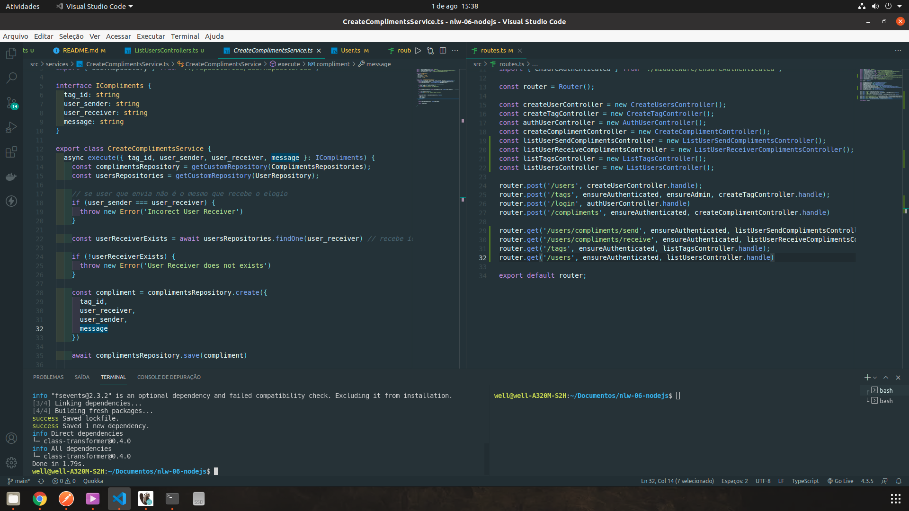
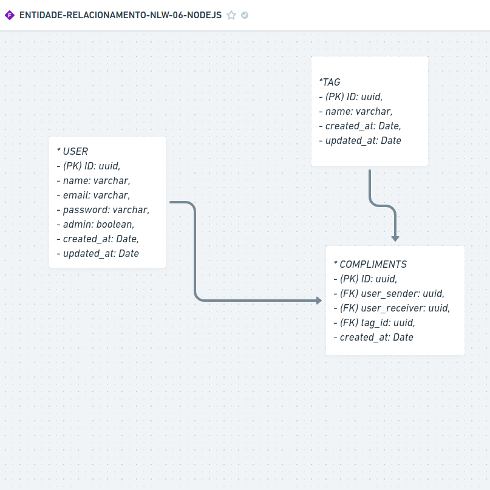
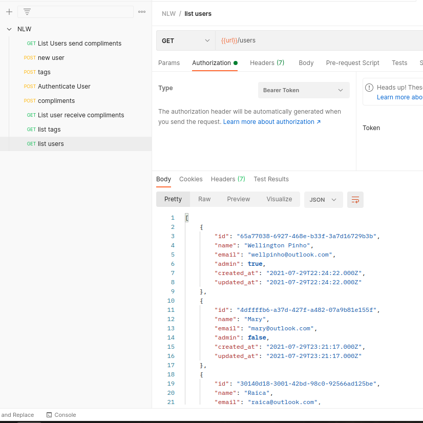

<h1 align="center">Valoriza</h1>

<p align="center">
  

  
</p>

<p align="center">
  
</p>

## Imagem feita no [whimscal](https://whimsical.com/)
<p align="center">
  
</p>

## POSTMAN
<p align="center">
  
</p>

## ✨ Tecnologias

Esse projeto foi desenvolvido com as seguintes tecnologias:

- [Node.js](https://nodejs.org/en/)
- [Typescript](https://www.typescriptlang.org/)
- [Express](https://expressjs.com/pt-br/)
- [JSONWebToken](https://github.com/auth0/node-jsonwebtoken#readme)

## 💻 Projeto

Valoriza é uma plataforma para promover o reconhecimento entre companheiros de equipe.

## 🚀 Como executar

- Clone o repositório
- 1. ```git clone https://github.com/wellpinho/nlw-06-nodejs.git```
- 2. ```cd nlw-06-nodejs```
- 3. `yarn` para baixar as dependências
- 4. `yarn typeorm migration:run` para criar as tabelas do banco de dados.
- 5. o `yarn dev` para iniciar a aplicação.

Acesse as rotas pelo Postman ou Insomnia: `http://localhost:4000`

# Endpoints
- Lista de usuários método GET: ```http://localhost:4000/users```
- Lista de tags método GET: ```http://localhost:4000/tags```
- Lista de usuários que enviaram elogios método GET: ```http://localhost:4000/users/compliments/send```
- Lista de usuários que receberam elogios método GET: ```http://localhost:4000/users/compliments/receive```
- 
- Criar novo usuário método POST: ```http://localhost:4000/users```
- Criar nova tag método POST: ```http://localhost:4000/tags```
- Enviar um elogio método POST: ```http://localhost:4000/compliments```
- Para se altenticar método POST: ```http://localhost:4000/login```

## 📄 Licença

Esse projeto está sob a licença MIT. Veja o arquivo [LICENSE](LICENSE.md) para mais detalhes.
No bootcamp da Rocketseat #nlw-06
Curso ministrado pela Dani Leão: [Linkedin da Dani](https://www.linkedin.com/in/danieleleaoevangelista/)

---
Feito com dedicação &nbsp;by Wellington Pinho 👋🏻 &nbsp;[Meu Linkedin](https://www.linkedin.com/in/wellpinho/)
